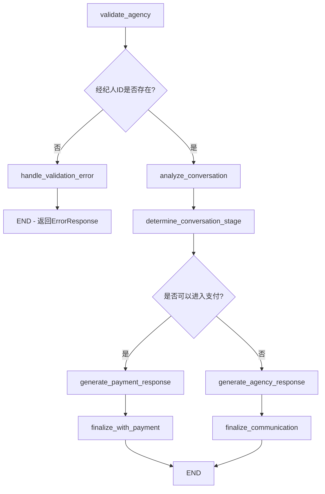

# 保险经纪人沟通接口设计文档

## 1. 概述

保险经纪人沟通接口是一个基于 LLM 的智能对话系统，旨在模拟真实保险经纪人与用户的沟通体验。该接口支持多种经纪人沟通风格，能够智能判断对话进展，并在合适的时机引导用户进入支付流程。

## 2. 核心设计理念

### 2.1 角色扮演驱动

- 使用 LLM 扮演不同风格的保险经纪人
- 每个经纪人具有独特的沟通特色和人格特征
- 通过精心设计的 prompt 确保角色一致性

### 2.2 智能流程控制

- 基于对话内容智能判断用户意图和需求
- 自动识别支付时机，无需人工干预
- 支持多轮对话的上下文理解

### 2.3 独立会话管理

- 与其他业务接口完全隔离的会话系统
- 独立的 sessionId 命名空间
- 支持会话超时和历史管理

## 3. 经纪人沟通风格

### 3.1 专业严谨型 (Professional)

**特点：**

- 语言正式，专业术语准确
- 逻辑清晰，使用总分结构
- 允许较长回答（150-200字）
- 绝不使用表情符号和语气词

**适用场景：** 高端客户、复杂产品咨询

### 3.2 亲和友善型 (Friendly)

**特点：**

- 口语化表达，亲切自然
- 大量使用表情符号和语气词
- 回答自动按换行符切分成多条消息
- 关注客户感受

**适用场景：** 普通消费者、初次接触保险的用户

### 3.3 热情积极型 (Enthusiastic)

**特点：**

- 语言充满活力和热情
- 主动预测用户后续问题
- 使用多变的问话结构引导对话
- 营造适度紧迫感

**适用场景：** 促销活动、限时优惠产品

### 3.4 咨询顾问型 (Consultative)

**特点：**

- 回答简洁，不超过100字
- 语气机械、冷淡
- 以问题引导对话
- 注重长期关系建立

**适用场景：** 企业客户、专业咨询

### 3.5 可靠信赖型 (Trustworthy)

**特点：**

- 诚实透明，不夸大宣传
- 站在用户角度思考问题
- 表现出高情商和同理心
- 即使用户拒绝也保持友好

**适用场景：** 敏感客户、高价值产品

## 4. 技术架构

### 4.1 LangGraph 工作流



### 4.2 核心组件

- **AgencyCommunicator**: 主要业务逻辑处理器
- **AGENCY_ROLE_PROMPTS**: 角色提示词模板库

### 4.3 数据流转

1. 接收用户请求，验证经纪人信息
2. 如果经纪人ID不存在，直接返回ErrorResponse并结束流程
3. 分析对话历史，理解用户意图
4. 判断对话阶段，决定响应策略
5. 生成经纪人回应或支付引导
6. 流式返回结果给客户端

## 5. 支付流程判断逻辑

### 5.1 判断标准

系统会综合评估以下5个维度来判断是否进入支付流程：

1. **购买意向明确性**: 用户是否明确表达了购买意愿
2. **疑虑解答完整性**: 主要问题和顾虑是否已得到解答
3. **对话充分性**: 是否已进行足够轮次的对话（至少3轮）
4. **问题完结性**: 用户是否还有重要的未解决问题
5. **感谢表达**: 用户是否表达了感谢（如"谢谢"、"太好了"等）

### 5.2 触发机制

当系统判断满足支付条件时，会：

1. 先返回经纪人的最终回应
2. 然后返回 PaymentResponse，引导进入支付流程
3. 在 PaymentResponse 中包含经纪人信息和推荐行动

## 6. 历史对话管理策略

### 6.1 无状态设计

- 不再维护服务器端会话状态
- 每次请求都通过 `history_chats` 参数传入完整的对话历史
- 简化了系统架构，提高了可扩展性

### 6.2 对话历史处理

- 客户端负责维护完整的对话历史
- 服务器端基于传入的历史对话进行分析和响应
- 支持任意长度的对话历史（建议客户端进行合理截断）

## 7. 错误处理机制

### 7.1 输入验证

- 验证经纪人ID是否存在于agents数组中，如果不存在则直接返回ErrorResponse
- 检查请求参数格式和类型
- 验证会话ID的有效性

### 7.2 异常处理

- LLM 调用失败的降级策略
- 网络超时的重试机制
- 数据格式错误的友好提示

### 7.3 错误响应

所有错误都通过统一的 ErrorResponse 格式返回：

```json
{
  "type": "error",
  "error": "错误类型",
  "details": "详细错误信息"
}
```

## 8. 性能优化

### 8.1 响应优化

- 使用 SSE 流式输出，提升用户体验
- 异步处理，避免阻塞
- 合理的超时设置

### 8.2 资源管理

- 会话数据的内存管理
- LLM 调用的频率控制
- 并发请求的负载均衡

### 8.3 缓存策略

- 经纪人信息缓存
- 常用提示词模板缓存
- 会话状态的高效存储

## 9. 扩展性设计

### 9.1 新增沟通风格

- 模块化的提示词模板设计
- 易于扩展的枚举类型
- 灵活的响应处理机制

### 9.2 多语言支持

- 国际化的提示词模板
- 多语言的错误消息
- 地区化的沟通风格

### 9.3 集成能力

- 标准化的接口设计
- 可插拔的存储后端
- 灵活的配置管理

## 10. 监控和日志

### 10.1 关键指标

- 会话成功率
- 支付转化率
- 平均对话轮次
- 响应时间分布

### 10.2 日志记录

- 经纪人切换事件
- 支付流程触发时机
- 用户交互关键节点
- 异常和错误详情

### 10.3 性能监控

- API 响应时间
- LLM 调用延迟
- 内存使用情况
- 并发处理能力

## 11. API 接口规范

### 11.1 接口地址

```http
POST /api/v2/agency/communicate
```

### 11.2 请求格式

**Content-Type:** `application/json`

**请求体结构:**

```json
{
  "user_id": 123,
  "session_id": 456,
  "history_chats": [
    {
      "role": "user",
      "content": "我想了解保险产品"
    },
    {
      "role": "assistant",
      "content": "好的，我来为您介绍"
    }
  ],
  "agency_id": 1,
  "agencies": [
    {
      "agency_id": 1,
      "name": "张经理",
      "tone": "professional",
      "experience_years": 5
    },
    {
      "agency_id": 2,
      "name": "李经理",
      "tone": "friendly",
      "experience_years": 3
    }
  ]
}
```

**字段说明:**

| 字段 | 类型 | 必填 | 说明 |
|------|------|------|------|
| user_id | number | 是 | 用户唯一标识符 |
| session_id | number | 是 | 会话唯一标识符，与其他接口独立 |
| history_chats | array | 是 | 历史对话数组，按时间顺序排列 |
| agency_id | number | 是 | 当前要扮演的经纪人ID |
| agencies | array | 是 | 所有可用经纪人信息数组 |

**history_chats 数组元素:**

| 字段 | 类型 | 说明 |
|------|------|------|
| role | string | 消息角色：`"user"`, `"assistant"`, `"system"` |
| content | string | 消息内容 |

**agencies 数组元素:**

| 字段 | 类型 | 说明 |
|------|------|------|
| agency_id | number | 经纪人唯一标识符 |
| name | string | 经纪人姓名 |
| tone | string | 沟通风格：`"professional"`, `"friendly"`, `"enthusiastic"`, `"consultative"`, `"trustworthy"` |
| experience_years | number | 从业年限 |

### 11.3 响应格式

**Content-Type:** `text/event-stream`

接口采用 SSE (Server-Sent Events) 流式输出，每个事件格式如下：

```text
data: {"type": "thinking", "content": "正在验证经纪人信息...", "step": "agency_validation"}

data: {"type": "answer", "content": "您好，我是张经理...", "data": {"agency_id": 1, "agency_name": "张经理"}}

data: {"type": "payment", "message": "这款产品应该很适合您", "agency_id": 1, "agency_name": "张经理", "recommended_action": "proceed_to_payment"}
```

### 11.4 响应类型详解

#### 11.4.1 思考过程响应 (ThinkingResponse)

```json
{
  "type": "thinking",
  "content": "正在分析对话历史...",
  "step": "conversation_analysis"
}
```

**字段说明:**

- `type`: 固定值 `"thinking"`
- `content`: 当前处理步骤的描述
- `step`: 处理步骤标识符

#### 11.4.2 经纪人回答响应 (AnswerResponse)

```json
{
  "type": "answer",
  "content": "根据您的情况，我建议...",
  "data": {
    "agency_id": 1,
    "agency_name": "张经理",
    "tone": "professional"
  }
}
```

**字段说明:**

- `type`: 固定值 `"answer"`
- `content`: 经纪人的回答内容
- `data`: 附加信息，包含经纪人详情

#### 11.4.3 支付流程响应 (PaymentResponse)

```json
{
  "type": "payment",
  "message": "这款产品应该很适合您，我这就将保单信息推送给您",
  "agency_id": 1,
  "agency_name": "张经理",
  "recommended_action": "proceed_to_payment"
}
```

**字段说明:**

- `type`: 固定值 `"payment"`
- `message`: 支付引导消息
- `agency_id`: 当前经纪人ID
- `agency_name`: 经纪人姓名
- `recommended_action`: 建议的后续行动

#### 11.4.4 错误响应 (ErrorResponse)

```json
{
  "type": "error",
  "error": "经纪人ID不存在",
  "details": "经纪人ID 999 不存在于提供的agents数组中"
}
```

**字段说明:**

- `type`: 固定值 `"error"`
- `error`: 错误类型描述
- `details`: 详细错误信息

## 12. 调用流程说明

### 12.1 基本调用流程

1. **准备请求数据**：构造包含用户ID、会话ID、历史对话、经纪人ID和经纪人列表的请求体
2. **发送 POST 请求**：向端点发送请求
3. **处理 SSE 流**：接收并解析服务器发送的事件流
4. **响应类型处理**：根据不同的响应类型执行相应的业务逻辑
5. **支付流程处理**：当收到 PaymentResponse 时，引导用户进入支付流程

### 12.2 响应处理逻辑

- **ThinkingResponse**：显示处理进度，提升用户体验
- **AnswerResponse**：展示经纪人回答，更新对话界面
- **PaymentResponse**：触发支付流程，结束当前对话
- **ErrorResponse**：处理错误情况，显示错误信息

### 12.3 历史对话管理要点

- 每次调用都需要传入完整的历史对话数组
- session_id 在整个对话过程中保持不变，仅用于标识对话会话
- 服务器端不维护会话状态，完全基于传入的历史对话进行处理
- 客户端负责维护和管理对话历史

## 13. 错误处理

### 13.1 常见错误类型

| 错误类型 | HTTP状态码 | 错误信息 | 解决方案 |
|----------|------------|----------|----------|
| 经纪人ID不存在 | 400 | "经纪人ID {agency_id} 不存在" | 检查agency_id是否在agents数组中 |
| 请求参数格式错误 | 422 | 参数验证失败详情 | 检查请求体格式和字段类型 |
| 服务器内部错误 | 500 | "服务器内部错误" | 稍后重试或联系技术支持 |
| LLM调用失败 | 503 | "AI服务暂时不可用" | 稍后重试 |

### 13.2 错误处理策略

#### 13.2.1 客户端重试策略

- 实施指数退避重试机制
- 最大重试次数建议设置为 3 次
- 对于网络错误和服务暂时不可用错误进行重试

#### 13.2.2 错误分类处理

- **参数验证错误**：提示用户修正输入参数
- **经纪人不存在错误**：切换到默认经纪人或提示选择其他经纪人
- **服务不可用错误**：显示重试选项或稍后再试提示
- **未知错误**：显示通用错误信息并记录日志

### 13.3 超时处理

#### 13.3.1 请求超时设置

- 建议设置 30 秒的请求超时时间
- 使用 AbortController 实现请求取消功能
- 在超时后清理相关资源

#### 13.3.2 流式响应超时

- 设置流式响应的数据接收超时（建议 10 秒）
- 监控数据接收间隔，及时发现连接异常
- 在超时时主动取消流式连接

## 14. 最佳实践

### 14.1 会话管理

#### 14.1.1 会话ID生成

- 推荐使用时间戳 + 随机数的方式生成唯一会话ID
- 确保会话ID在系统中的唯一性
- 避免使用可预测的会话ID生成规则

#### 14.1.2 会话状态维护

- 在客户端维护会话状态和历史消息
- 定期清理过期的会话数据
- 实现会话恢复机制，支持页面刷新后继续对话

### 14.2 性能优化

#### 14.2.1 请求去重

- 实施请求去重机制，避免重复发送相同请求
- 使用请求参数的哈希值作为去重键
- 在请求完成后及时清理去重缓存

#### 14.2.2 响应缓存

- 对于相同的请求参数，可以缓存响应结果
- 设置合理的缓存过期时间（建议5分钟）
- 注意缓存的内存使用，定期清理过期缓存

### 14.3 用户体验优化

#### 14.3.1 加载状态显示

- 根据不同的处理步骤显示相应的加载提示
- 提供清晰的进度反馈，让用户了解当前处理状态
- 避免长时间无反馈的等待体验

#### 14.3.2 渐进式内容显示

- 实现打字机效果，逐字显示经纪人回答
- 控制显示速度，提升阅读体验
- 支持用户跳过动画，直接显示完整内容

## 15. 安全考虑

### 15.1 输入验证

- 对所有用户输入进行严格验证
- 防止 SQL 注入和 XSS 攻击
- 限制消息长度和频率

### 15.2 访问控制

- 验证用户身份和权限
- 实施会话超时机制
- 记录关键操作日志

### 15.3 数据保护

- 敏感信息加密存储
- 传输过程使用 HTTPS
- 定期清理过期会话数据

## 16. 部署配置

### 16.1 环境变量

```bash
# 保险经纪人沟通相关配置
AI_INSUR_AGENCY_SESSION_TIMEOUT=3600    # 会话超时时间（秒）
AI_INSUR_AGENCY_MAX_HISTORY=50          # 最大历史消息数
AI_INSUR_AGENCY_PROFESSIONAL_MAX_LENGTH=200  # 专业严谨型回应最大长度
AI_INSUR_AGENCY_CONSULTATIVE_MAX_LENGTH=100  # 咨询顾问型回应最大长度
AI_INSUR_AGENCY_DEFAULT_MAX_LENGTH=150       # 其他风格回应最大长度
```

### 16.2 监控指标

- 接口响应时间
- 支付转化率
- 错误率统计
- 并发用户数

---

**注意**: 本文档描述的是保险经纪人沟通接口的完整设计和使用方法。在实际使用中，请根据具体业务需求调整参数和配置。
