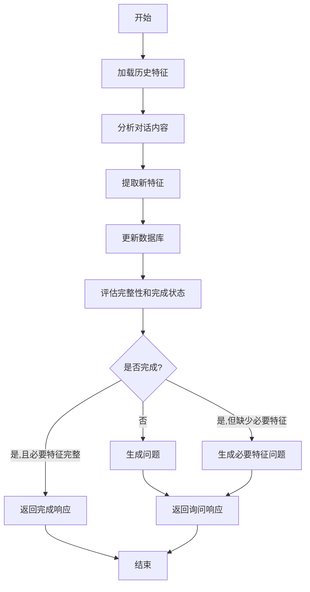

# 用户画像分析功能设计文档

## 1. 需求概述

### 1.1 功能目标

实现 `/api/v1/profile/analyze` 接口，使用 mem0 框架进行用户画像分析，包括：

- 从对话历史中提取用户特征
- 主动询问缺失的重要信息
- 管理用户特征的置信度和完整性
- 将特征数据持久化到 MySQL 数据库
- 扮演保险经纪人角色，自然友好地与用户交流

### 1.2 核心技术栈

- **mem0ai**: 用于记忆管理和用户特征提取
- **MySQL**: 用户特征数据持久化
- **LangGraph**: 工作流编排
- **FastAPI**: 异步 API 接口

## 2. 用户特征体系设计

### 2.1 特征分类 (Categories)

#### 基础身份维度 (basic_identity)

- `name` (string): 姓名 - 个人身份标识
- `gender` (string): 性别 (男/女) - 产品匹配、费率计算
- `date_of_birth` (string): 出生年月日 (YYYY-MM-DD) - 精确年龄计算、产品适配、费率计算
- `marital_status` (string): 婚姻状况 (未婚/已婚/离异/丧偶) - 家庭责任评估
- `residence_city` (string): 常住城市 - 产品地区限制、医疗资源评估
- `occupation_type` (string): 职业类型 (企业员工/公务员/个体经营/企业主/自由职业/学生/退休) - 职业风险评估、产品匹配
- `industry` (string): 所属行业 - 职业风险评估、收入稳定性判断

#### 女性特殊状态 (female_specific) - 仅女性

- `pregnancy_status` (string): 孕期状态 (未怀孕/备孕期/孕早期(1-3月)/孕中期(4-6月)/孕晚期(7-9月)/产后恢复期) - 母婴保险需求评估、费率计算
- `childbearing_plan` (string): 生育计划 (1年内/2年内/3年内/暂无计划) - 母婴保障规划、产品推荐

#### 家庭结构与责任维度 (family_structure)

- `family_structure` (string): 家庭结构 (单身/夫妻/夫妻+子女/三代同堂/其他) - 家庭责任评估基础
- `number_of_children` (int): 子女数量 - 教育规划需求、家庭责任计算
- `caregiving_responsibility` (string): 赡养责任 (无/赡养父母/赡养双方父母/其他) - 家庭责任评估
- `monthly_household_expense` (float): 月度家庭支出 (元) - 家庭责任计算、寿险保额计算
- `mortgage_balance` (float): 房贷余额 (元) - 家庭责任计算、寿险保额计算
- `is_family_financial_support` (string): 是否家庭经济支柱 (是/否/共同承担) - 家庭责任评估、保额计算

#### 财务现状与目标维度 (financial_status)

- `annual_total_income` (float): 年总收入 (万元) - 保额计算、预算规划
- `income_stability` (string): 收入稳定性 (非常稳定/比较稳定/一般/不稳定) - 风险评估、产品选择
- `annual_insurance_budget` (float): 年度保险预算 (万元) - 产品组合规划、保费预算分配

#### 健康与生活习惯维度 (health_lifestyle)

- `overall_health_status` (string): 整体健康状况 (非常健康/比较健康/一般/有慢性病/健康状况较差) - 产品匹配、费率计算
- `has_chronic_disease` (string): 是否有慢性疾病 (无/高血压/糖尿病/心脏病/其他) - 承保评估、产品匹配
- `smoking_status` (string): 吸烟情况 (不吸烟/已戒烟/轻度吸烟/重度吸烟) - 健康风险评估、费率计算
- `recent_medical_checkup` (string): 近期体检情况 (1年内正常/1年内有异常/2年内正常/2年以上未体检) - 健康风险评估、承保评估

### 2.2 必要特征定义

以下特征为必要特征，即使用户拒绝回答也需要在最后阶段重新询问：

- `gender` (性别)
- `date_of_birth` (出生年月日)
- `marital_status` (婚姻状况)
- `occupation_type` (职业类型)
- `industry` (所属行业)
- `family_structure` (家庭结构)
- `monthly_household_expense` (月度家庭支出)
- `is_family_financial_support` (是否家庭经济支柱)
- `annual_total_income` (年总收入)
- `income_stability` (收入稳定性)
- `annual_insurance_budget` (年度保险预算)
- `overall_health_status` (整体健康状况)

## 3. 数据库设计

### 3.1 用户特征表 (user_profile)

```sql
CREATE TABLE `user_profile` (
  `id` int(11) NOT NULL AUTO_INCREMENT,
  `user_id` int(11) NOT NULL,
  `category_name` varchar(255) NOT NULL,
  `feature_name` varchar(255) NOT NULL,
  `feature_value` json NOT NULL,
  `confidence` float NOT NULL DEFAULT '0.0',
  `skipped` tinyint(1) NOT NULL DEFAULT '0',
  `created_at` timestamp DEFAULT CURRENT_TIMESTAMP,
  `updated_at` timestamp DEFAULT CURRENT_TIMESTAMP ON UPDATE CURRENT_TIMESTAMP,
  PRIMARY KEY (`id`),
  UNIQUE KEY `user_id` (`user_id`, `category_name`, `feature_name`),
  INDEX `idx_user_id` (`user_id`),
  INDEX `idx_category` (`category_name`)
) ENGINE=InnoDB DEFAULT CHARSET=utf8mb4 COLLATE=utf8mb4_unicode_ci;
```

### 3.2 置信度规则

- **custom_profile 提供的信息**: 1.0
- **用户直接提到的信息**: 0.8
- **上下文推理的信息**: 0.5
- **用户拒绝回答**: 0.0 (标记 skipped=1)
- **重复提及同一特征**: 每次 +0.1，最高 0.9
- **矛盾信息处理**: 以最新为准，置信度设为 0.5，需要主动询问澄清

### 3.3 特征询问策略

- **按 category 顺序询问**: 从基础身份维度开始，逐步深入
- **女性特殊状态**: 仅当分析出用户是女性的可能性 > 0.5 时才询问
- **保险经纪人角色**: 用自然、舒适的方式询问，避免审问感
- **允许跳过**: 用户可以拒绝回答非必要问题
- **skipped 特征重询**: 当所有特征都问过后，对必要特征进行友好的重新询问

## 4. 技术架构设计

### 4.1 核心组件

1. **ProfileAnalyzer**: 主要分析器类
2. **MemoryManager**: mem0 记忆管理封装
3. **DatabaseManager**: MySQL 数据库操作封装
4. **QuestionGenerator**: 智能问题生成器
5. **ConfidenceEvaluator**: 置信度评估器

### 4.2 工作流设计 (LangGraph)



### 4.3 mem0 集成方案

- 使用 mem0 的用户记忆功能存储对话上下文
- 利用 mem0 的智能提取能力识别用户特征
- 结合 mem0 的时间序列记忆跟踪特征变化
- 为每个用户创建独立的记忆空间 (user_id)

### 4.4 数据库适配策略

- **开发环境**: 使用 SQLite 数据库，便于本地调试
- **生产环境**: 使用 MySQL 数据库，确保性能和稳定性
- **ORM 框架**: 使用 SQLAlchemy 异步 ORM 进行数据库操作
- **连接管理**: 根据环境变量自动选择数据库类型

## 5. 接口设计

接口地址：`/api/v1/profile/analyze`

### 5.1 请求格式

```python
class ProfileAnalysisRequest(TypedDict):
    user_id: int
    session_id: int
    history_chats: List[ChatMessage]
    custom_profile: Optional[UserProfile]
```

### 5.2 响应格式

接口采用 SSE (Server-Sent Events) 流式输出，支持以下响应类型：

#### 5.2.1 思考过程响应 (ThinkingResponse)

```python
class ThinkingResponse(BaseResponse):
    type: str  # "thinking"
    content: str  # 思考内容描述
    step: str    # 当前执行步骤
```

#### 5.2.2 特征提取响应 (ProfileResponse) - 新增

```python
class ProfileResponse(BaseResponse):
    type: str  # "profile"
    features: List[Dict[str, Any]]  # 新提取的特征数据列表
    message: Optional[str]  # 可选的说明信息
```

特征数据格式 (FeatureData)：

```python
{
    "category_name": str,    # 特征分类名称
    "feature_name": str,     # 特征名称
    "value": Any,           # 特征值
    "confidence": float,    # 置信度 (0.0-1.0)
    "skipped": bool,        # 是否被用户跳过
}
```

#### 5.2.3 询问响应 (AnswerResponse)

```python
class AnswerResponse(BaseResponse):
    type: str  # "answer"
    content: str  # 询问的问题内容
    data: Optional[Dict[str, Any]]  # 附加数据
```

#### 5.2.4 完成响应 (UserProfileCompleteResponse)

```python
class UserProfileCompleteResponse(BaseResponse):
    type: str  # "profile_complete"
    message: str
    profile_summary: Dict[str, Any]
    completion_rate: float
```

#### 5.2.5 错误响应 (ErrorResponse)

```python
class ErrorResponse(BaseResponse):
    type: str  # "error"
    error: str
    details: Optional[str]
```

### 5.3 接口协议详细说明

#### 5.3.1 响应流程

1. **初始化阶段**

   ```json
   {"type": "thinking", "content": "正在加载您的已有信息...", "step": "load_features"}
   ```

2. **对话分析阶段**

   ```json
   {"type": "thinking", "content": "正在分析您的对话内容...", "step": "analyze_conversation"}
   ```

3. **特征提取阶段**

   ```json
   {"type": "thinking", "content": "正在提取新的用户特征...", "step": "extract_features"}
   ```

4. **特征返回阶段** (新增 - 及时返回)

   ```json
   {
     "type": "profile",
     "features": [
       {
         "category_name": "basic_identity",
         "feature_name": "gender",
         "value": "女",
         "confidence": 0.8,
         "skipped": false
       },
       {
         "category_name": "financial_status",
         "feature_name": "annual_total_income",
         "value": 50.0,
         "confidence": 1.0,
         "skipped": false
       }
     ],
     "message": "成功提取了 2 个用户特征"
   }
   ```

5. **数据库更新阶段**

   ```json
   {"type": "thinking", "content": "正在更新您的用户画像...", "step": "update_database"}
   ```

6. **完整性评估阶段**

   ```json
   {"type": "thinking", "content": "正在评估画像完整性...", "step": "evaluate_completeness"}
   ```

7. **询问阶段** (如果需要更多信息)

   ```json
   {
     "type": "answer",
     "content": "为了给您提供更精准的保险建议，请问您的年龄是多少呢？",
     "data": {
       "questions": "为了给您提供更精准的保险建议，请问您的年龄是多少呢？",
       "completion_status": {
         "coverage_analysis": {...},
         "required_completeness": {...}
       }
     }
   }
   ```

8. **完成阶段** (如果信息充足)

   ```json
   {
     "type": "profile_complete",
     "message": "用户画像分析完成",
     "profile_summary": {
       "basic_identity": {...},
       "financial_status": {...},
       ...
     },
     "completion_rate": 0.85
   }
   ```

#### 5.3.2 日志增强功能

系统现在包含详细的 LLM 调用日志记录：

- **调用开始**: 记录操作名称和 prompt 前100个字符
- **调用完成**: 记录耗时、token 消耗、响应长度
- **Token 统计**: 包括 prompt tokens、completion tokens、total tokens
- **性能监控**: 精确到毫秒的调用耗时统计

示例日志输出：

```text
INFO: 开始 LLM 调用 - 特征提取
INFO: Prompt 预览: 你是一个专业的保险经纪人，需要从用户对话中提取用户特征信息。请仔细分析对话内容，识别并提取以下类型的用户特征...
INFO: LLM 调用完成 - 特征提取
INFO: 耗时: 2.34秒
INFO: Tokens - Prompt: 1250, Completion: 380, Total: 1630
INFO: 响应长度: 1024 字符
```

#### 5.3.3 特征提取时机

- **及时返回**: 一旦从对话或自定义画像中提取出特征，立即通过 ProfileResponse 返回
- **批量处理**: 每次特征提取操作完成后，将所有新特征一次性返回
- **增量更新**: 支持多轮对话中的特征增量提取和返回

#### 5.3.4 错误处理

```json
{
  "type": "error",
  "error": "分析过程中发生错误",
  "details": "具体错误信息"
}
```

## 6. 实现计划

### 6.1 第一阶段：基础架构

1. 更新 UserProfile 类型定义，包含所有特征字段
2. 添加 mem0ai、aiomysql 等依赖到 pyproject.toml
3. 创建数据库连接和操作管理器
4. 实现基础的特征提取和存储逻辑

### 6.2 第二阶段：核心功能

1. 实现完整的 LangGraph 工作流
2. 开发基于 mem0 的智能特征提取
3. 实现置信度评估和冲突处理算法
4. 开发智能问题生成逻辑

### 6.3 第三阶段：优化完善

1. 实现特征完整性检查和完成判断
2. 优化问题询问策略和用户体验
3. 添加完善的错误处理和日志记录
4. 性能优化和全面测试

### 6.4 依赖管理

需要添加的新依赖：

- `mem0ai`: 记忆管理框架
- `sqlalchemy[asyncio]`: 异步 ORM 支持
- `aiosqlite`: SQLite 异步驱动（开发环境）
- `aiomysql`: MySQL 异步驱动（生产环境）

## 7. 关键技术细节

### 7.1 mem0 使用策略

- 为每个用户创建独立的记忆空间
- 使用结构化提示词引导特征提取
- 利用 mem0 的相关性搜索优化问题生成

### 7.2 问题生成策略

- 按 category 顺序逐步询问
- 女性特殊状态仅在性别确认后询问
- 使用自然对话方式，避免审问感
- 允许用户跳过非必要问题

### 7.3 完成判断逻辑

**评估完整性和完成状态**（合并为一个步骤）：

1. **特征覆盖检查**: 分析当前所有特征（包括 skipped）是否已覆盖所有可能的特征
2. **必要特征检查**: 检查必要特征是否都有值（置信度 > 0.5）
3. **完成条件判断**:
   - 如果特征覆盖不完整 → 继续生成问题
   - 如果特征覆盖完整但缺少必要特征 → 生成必要特征问题
   - 如果特征覆盖完整且必要特征完整 → 返回完成响应

### 7.4 数据库操作策略

- **异步操作**: 所有数据库操作使用 SQLAlchemy 异步执行
- **环境适配**: 开发环境使用 SQLite，生产环境使用 MySQL
- **事务管理**: 特征更新使用事务确保数据一致性
- **冲突处理**: 使用 UPSERT 操作处理特征值更新
- **索引优化**: 基于 user_id 和 category_name 建立索引

## 8. 风险与挑战

### 8.1 技术风险

- mem0 框架的稳定性和性能
- 大量数据库写操作的性能影响
- LLM 特征提取的准确性

### 8.2 业务风险

- 用户隐私敏感信息的处理
- 问题询问频率对用户体验的影响
- 特征冲突时的处理策略

### 8.3 缓解措施

- 实现完善的错误处理和重试机制
- 添加用户隐私保护措施
- 设计优雅的问题询问策略
- 建立特征冲突解决机制

## 9. 设计总结

### 9.1 核心特性

1. **完整的用户特征体系**: 涵盖基础身份、家庭结构、财务状况、健康状况等 5 大维度 20+ 特征
2. **智能特征提取**: 基于 mem0 框架的对话分析和特征识别
3. **置信度管理**: 多层次置信度评估和冲突处理机制
4. **自然交互**: 保险经纪人角色的友好询问方式
5. **数据持久化**: MySQL 数据库的异步存储和管理
6. **及时特征返回**: 一旦提取出特征立即通过 ProfileResponse 返回 (新增)
7. **详细日志记录**: LLM 调用耗时、token 消耗、prompt 预览等全面监控 (新增)

### 9.2 技术亮点

1. **异步架构**: 全面使用 asyncio 确保高性能
2. **工作流编排**: LangGraph 实现复杂业务逻辑
3. **记忆管理**: mem0 提供智能上下文理解
4. **类型安全**: 完整的 TypedDict 类型定义
5. **数据库适配**: SQLite/MySQL 双环境支持
6. **智能完成判断**: 合并的完整性评估和完成状态检查
7. **流式响应**: SSE 支持多种响应类型的实时流式输出 (新增)
8. **性能监控**: 详细的 LLM 调用性能统计和日志记录 (新增)

### 9.3 用户体验

1. **渐进式收集**: 按优先级逐步收集用户信息
2. **智能问题**: 基于已有信息生成相关问题
3. **灵活跳过**: 允许用户跳过敏感或非必要问题
4. **完成感知**: 明确的完成状态和进度反馈
5. **实时反馈**: 特征提取后立即返回，用户可实时看到分析结果 (新增)
6. **透明处理**: 详细的思考过程展示，用户了解系统工作状态 (新增)

---

## 10. 重构完成事项

根据重构需求，已完成以下功能实现：

### 10.1 已完成功能 ✅

1. **ProfileResponse 类型定义**: 新增用于返回提取特征的响应类型
   - 包含 features 字段存放 FeatureData 列表
   - 支持可选的 message 说明信息
   - 已集成到 AgentResponse 联合类型中

2. **及时特征返回**: 修改工作流实现特征提取后立即返回
   - 在 extract_new_features 节点完成后检查新特征
   - 自动将 FeatureData 转换为 ProfileResponse 格式
   - 支持批量特征的一次性返回

3. **增强 LLM 调用日志**: 实现详细的性能监控和日志记录
   - 新增 `_call_llm_with_logging` 统一日志方法
   - 记录 prompt 前100个字符预览
   - 统计精确的调用耗时（秒级精度）
   - 记录 token 消耗（prompt/completion/total）
   - 记录响应内容长度

4. **API 接口更新**: 更新接口文档和响应类型支持
   - 更新接口注释说明新的响应类型
   - 自动支持 ProfileResponse 的 SSE 流式输出

5. **设计文档更新**: 完善接口协议和技术细节说明
   - 详细的响应流程说明
   - 完整的响应类型定义
   - 日志功能和特征提取时机说明
   - 错误处理和用户体验改进

### 10.2 技术实现亮点

- **类型安全**: 完整的 TypedDict 定义确保类型安全
- **性能监控**: 全面的 LLM 调用性能统计
- **实时反馈**: 特征提取后的即时响应机制
- **向后兼容**: 保持原有接口协议的完全兼容性

### 10.3 用户体验提升

- **透明度**: 用户可实时看到特征提取结果
- **性能感知**: 详细的处理过程和耗时信息
- **数据可见**: 清晰的特征数据结构和置信度信息
