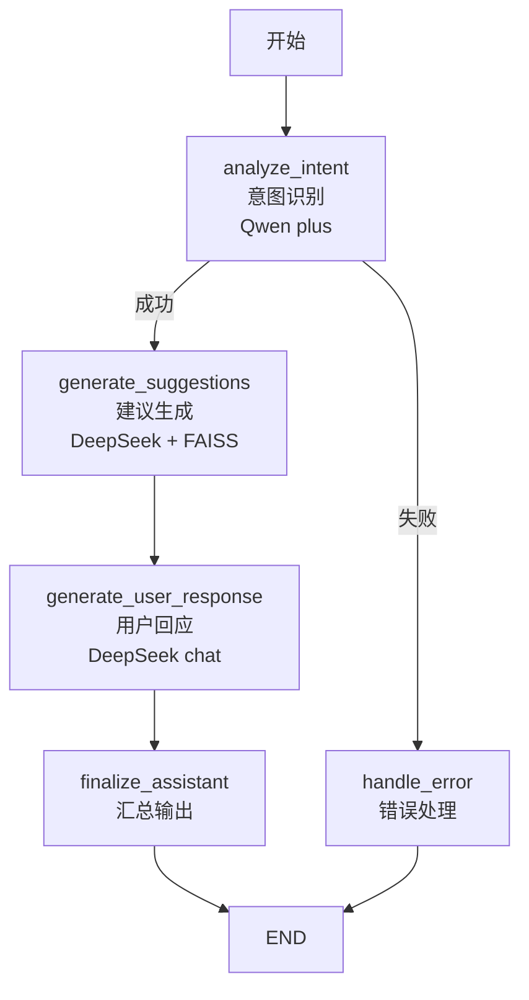
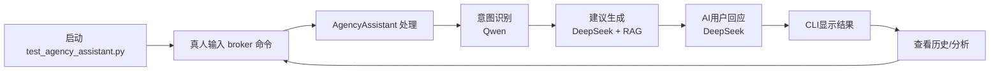
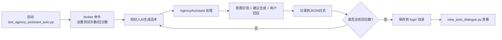

# 智能对话助理系统技术报告

## 一、系统概述

### 1.1 核心功能

- **意图识别分析**：对保险经纪人话语进行6个维度的深度分析
- **风险预警**：基于RAG技术检索保险行业坑点数据库，提供实时风险提示
- **智能建议生成**：为用户提供结构化的对话建议（提醒模块+提问模块）
- **AI用户回应**：生成符合真实用户特征的自然回应
- **自动测试**：支持自动化AI对话测试

### 1.2 技术架构

系统采用模块化设计，基于以下核心技术栈：

- **工作流引擎**：LangGraph - 构建复杂的AI工作流
- **大语言模型接口**：DeepSeek（对话生成）+ Qwen（意图识别）
- **RAG技术**：LangChain + FAISS + DashScope Embeddings
- **API框架**：FastAPI - 提供RESTful接口
- **测试框架**：双模式测试（交互式 + 自动化）

## 二、核心组件

### 2.1 组件架构图

系统整体架构如下所示（详见本页文末的 Mermaid 图），覆盖了数据预处理、RAG 检索、LangGraph 工作流、API 层以及两种测试方式等主要流程。

### 2.2 功能组件详解

- **`util/rag_pit_detector.py`**
  - `PitDataLoader`：使用 JSONLoader 解析 `insurance_pits_merged.json`，做文本清洗与分块。
  - `PitVectorStore`：负责向量化、批量写入 FAISS，并对 DashScope API 做批次控制。
  - `PitRetriever`：提供语义检索与关键词混合检索接口，并可格式化坑点提示。
- **`agent/agency_assistant.py`**
  - 通过 LangGraph 将 *意图识别 → 建议生成 → 用户回应* 三个节点串成工作流。
  - 集成 RAG 检索结果到 `_generate_suggestions`，输出结构化 JSON。
- **`api/agency_assistance.py`**
  - 基于 FastAPI 提供 `/assistant` SSE 接口，流式返回分析结果。
- **测试工具**
  - `test_agency_assistant.py`：交互式 CLI，真人扮演经纪人。
  - `test_agency_assistant_auto.py`：三 AI（经纪人、用户、建议）自动对战，可批量回合并保存日志。
- **其他辅助**
  - `tools/preprocess_pits_data.py`：离线预处理脚本（现已移动到 `util/`）。
  - `view_auto_dialogue.py`：日志浏览与关键字检索工具。

### 2.3 Langgraph工作流

工作流说明：

- **条件分支**：`analyze_intent` 若失败进入 `handle_error`，否则进入 `generate_suggestions`
- **线性流转**：建议生成 → 用户回应 → 汇总输出 → 结束
- **错误处理**：任何节点出错都会被捕获并返回错误信息

## 三、工作流程

### 手动测试与自动化测试流程

#### 交互式测试流程

#### 自动化测试流程

两种测试共用同一核心 `AgencyAssistant` 实例，因此任何业务逻辑变动都能在两种模式下即时验证。

## 四、技术选择与参数设定

### 4.1 大语言模型选择

DeepSeek-chat（对话生成）

Qwen-30b-a3b（意图识别）

### 4.2 RAG技术栈选择

嵌入模型：DashScope Embedding
向量数据库：FAISS

### 4.3 检索参数优化

similarity_threshold=0.2  # 较低阈值提高召回率，方便测试
top_k=5  # 返回前5个最相关结果

## 五、未来可扩展方向

1. **改善检索方式**：目前主要依赖向量检索。可以考虑和关键词检索结合的混合检索，或者对于数据本身进一步结构化。
2. **与产品推荐AI的互动**：深入产品信息，并将产品推荐作为对手AI
3. **动态Prompt策略**：事先定义`意图分析`中的`经纪人阶段性意图识别`集合，然后在定义好的集合中进行选择。根据不同的`经纪人阶段性意图识别`动态调整建议生成的Prompt，以生成更有针对性的提问。
4. **多轮规划建议**：将系统的建议从仅针对下一轮对话变成针对下几轮对话。系统可以基于典型的保险购买流程，主动提示接下来几轮应该怎么问。
